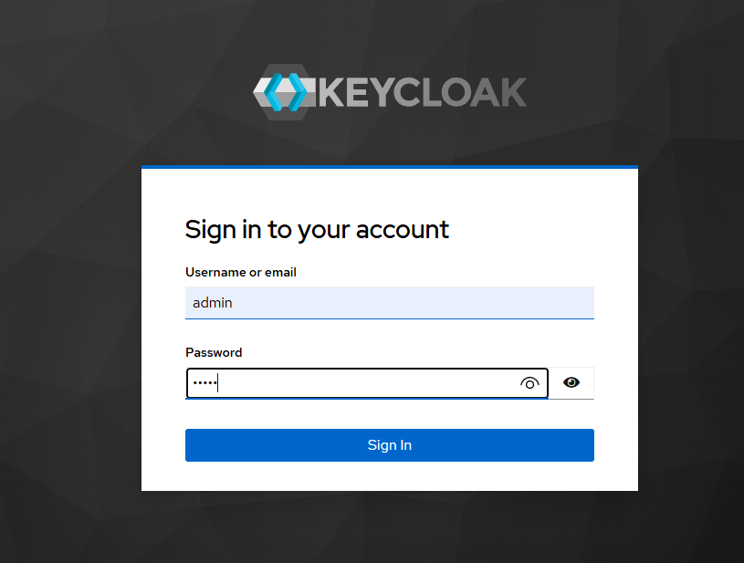
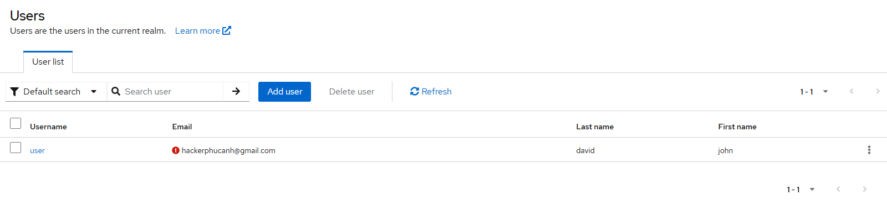
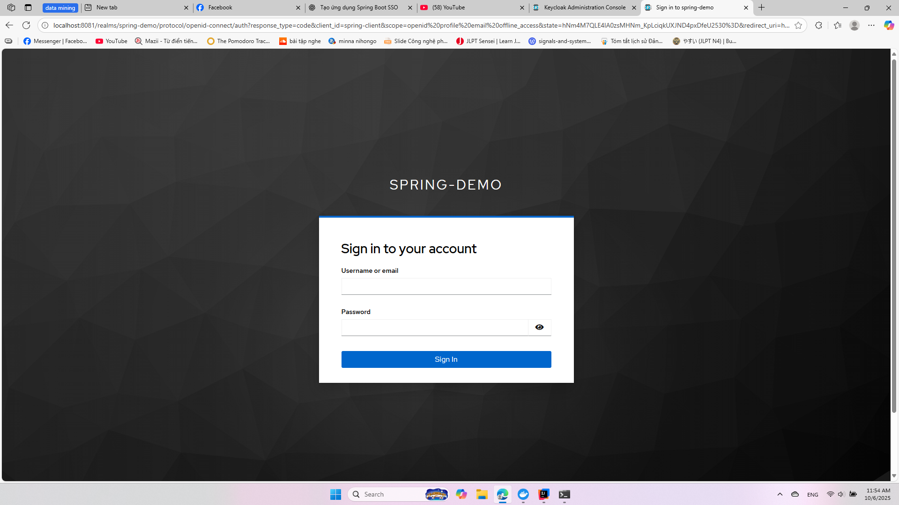
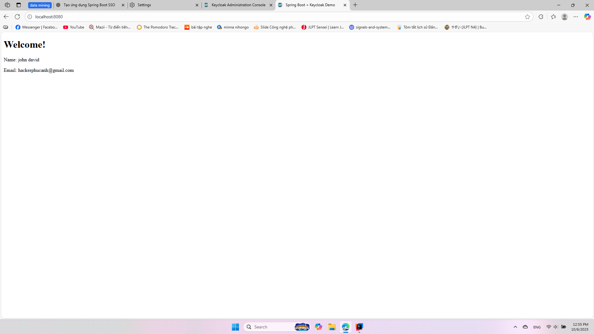
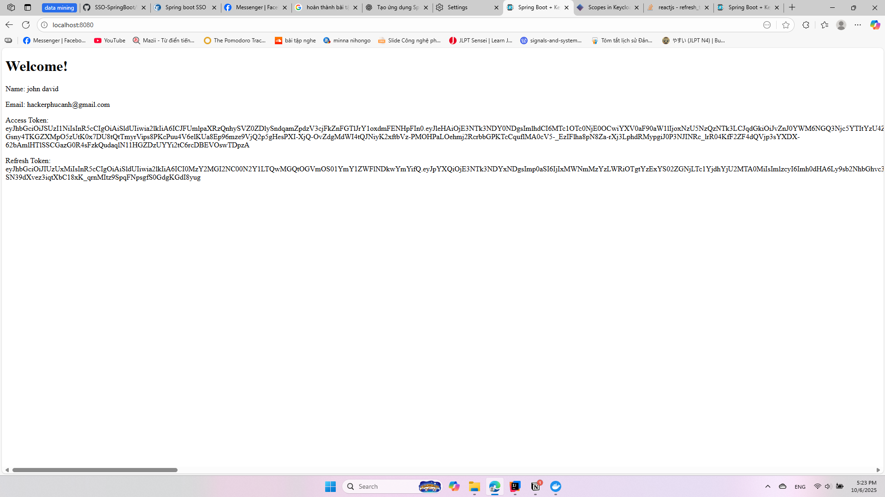

# SSO-SpringBoot

# Spring Boot Demo Screenshots

Dưới đây là các ảnh minh họa cho ứng dụng Spring Boot của chúng tôi.

## 1. Admin Login

Đăng nhập bằng tài khoản **admin** để tạo một realm có tên **spring-demo**. Trong realm này, bạn có thể tạo tài khoản người dùng và thiết lập các **clients**.

## 2. User Account Page

Tạo tài khoản dành cho người dùng trong realm **spring-demo**.

## 3. User Login

Người dùng đăng nhập vào ứng dụng bằng tài khoản đã được tạo.

## 4. Result Page

Sau khi được **ủy quyền** từ Keycloak, người dùng sẽ được chuyển hướng trở về trang ứng dụng Spring Boot. Trang này sẽ hiển thị **email** và **tên** của người dùng.

## 5.refresh token

